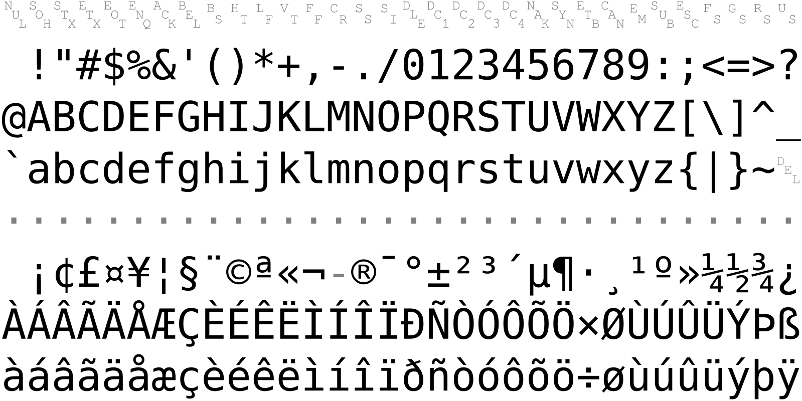
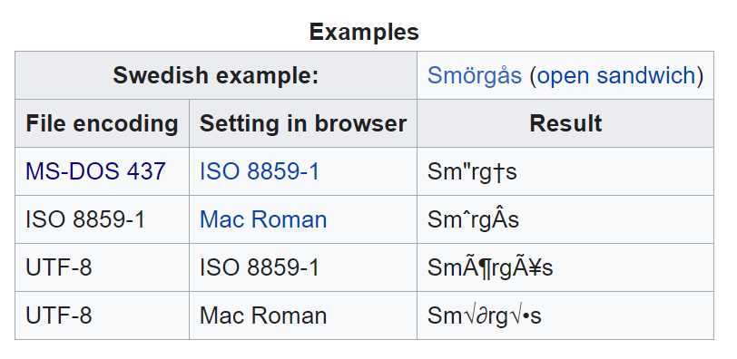

```{r setup, echo=FALSE}
knitr::opts_chunk$set(echo = TRUE)
```

### Some resources that I am drawing from

+ http://www.pmean.com/12/pesky.html
+ http://blog.pmean.com/weird-characters/
+ http://www.pmean.com/posts/non-breaking-space.html
  + Please note that the image links on this page are broken
  
<div class="notes">

I've struggled in the past with some text files because the have oddball characters. They look normal from the outside, but hiding inside them is pure trouble.

Here are some blog posts that I have posted in the past about this and I will use material from these in this presentation.

</div>

### 7-bit ASCII


<div class="notes">

ASCII is short for American Standard Code for Information Interchange.

This is a table of the 7-bit ASCII characters, taken from Wikipedia.

https://upload.wikimedia.org/wikipedia/commons/1/1b/ASCII-Table-wide.svg

</div>

### Some important 7-bit ASCII characters

+ Invisible 7-bit ASCII (Teletype codes)
  + Decimal 09, Hex 09, tab (also \t in r)
  + Decimal 13, carriage return (also \n in r)
  + Decimal 12, line feed
+ Printable 7-bit ASCII
  + Decimal 32, Hex 20, blank
  + Decimal 34, Hex 22, straight double quote (")
  + Decimal 39, Hex 27, straight single quote (')
  + Decimal 96, Hex 60,  backtick (`)
+ Note: Decimal 127, Hex 7F is also non-printable  

<div class="notes">

The 128 characters available in 7-bit ASCII include 32 non-printable or invisible charcters from Decimal 0 to Decimal 31 and 96 printable characters from Decimal 32 to Decimal 127.

The non-printable characters are a holdover from the age of teletype machines, large typewriter-like printers that could receive information remotely. You might see these in early movie scenes in newspaper rooms or government buildings.

</div>

### 8-bit extensions, codepage-437


<div class="notes">

This character set was developed early in the life of the IBM PC and you can sometimes see these characters during the early stages of a computer boot-up. Two notable features of this character set are the use of dingbats in the first 32 characters instead of non-printable characters and box-drawing characters that allowed some primitive semi-graphical displays on a computer monitor without graphic capabilities.

</div>

### 8-bit extensions, Latin-1



<div class="notes">

Another 8-bit extension is Latin-8. It includes a faint echo of the non-printable characters at Hex 80 through Hex 9F.

</div>

### 8-bit extensions, Windows-1252


<div class="notes">

A popular 8-bit encoding that you can still see today is Windows-1252.

</div>

### Problems with 8-bit ASCII

+ Most text files do not self-identify the 8-bit ASCII used
+ Sometimes distinguishable, sometimes not
+ Incorrect assumptions lead to "mojibake"
  + Common codes for mistranslation are
    + ?
    + `r "\U25AF"` 
    + �

<div class="notes">

The various forms of 8-bit ASCII cause all sorts of headaches. A file normally does not include information about the 8-bit ASCII used. Sometimes there are obvious hints in the file but sometimes not. If you make an incorrect assumption about the version of ASCII used, you will produce occasional random garbage characters.

</div>

### Mojibake example


<div class="notes">

Here is an amusing example on the Wikipedia page on mojibake. Notice that sometimes the Swedish characters expand to two characters.

</div>

### Unicode standard

+ Extends character set to 32 bits
  + (4,294,967,296 characters)
  + All current languages (`r "\U4E2D\U56FD"`)
  + Many obsolete languages (`r "\U13047\U13048\U13049"`)
  + Many emojis (`r "\U1F431\U1F436"`)
  
<div class="notes">

The Unicode character set is huge and encompasses every current language, many ancient languages, and many emojis. If you want to change your plotting symbols from a boring circle or plus sign, you can put cats and dogs on your graph instead.

</div>

### UTF-8


<div class="notes">

UTF is a multibyte standard, backwards compatible with 7-bit ASCII. A leading bit 0 implies 7-bit ASCII (single byte). Leading bits 110 implies two byte combination. Leading bits 1110 implies three byte combination. Leading bits 1111 implies four byte combination. Second, third, fourth bits always lead with 10.
  
The variable number of bytes is quite clever. If every character were 32 bits instead of 8 bits, the size of every text file would quadruple. But if all your characters are in 7-bit ASCII, your file does not increase in size. For files with just a handful of exotic characters, the file size increases only slightly.

For some languages and character sets, it can increase the size.

</div>

### Character to hexadecimal

```{r}
charToRaw(" ")
```

<div class="notes">

If you have a character and you want to see what the hexadecimal value in the ASCII table would be, use the charToRaw function.

</div>

### Hexadecimal to character

```{r}
"\x20"
"\040"
"\U20"
```

<div class="notes">

If you precede a hexadecimal code with backslash-x, R will convert it to the appropriate ASCII character.

Just for reference, you can also get Octal and unicode values.

</div>

### Changing encoding

+ These solutions may or may not work.
  + file()
  + iconv(x, from=, to=)
  + read.table(fileEncoding=) or read.table(encoding=)
  + Sys.setlocale(locale=)

### Why are tab characters bad?

```{r}
print("\x28\x09\x29")
cat("\x28\x09\x29")
print("\x28\x20\x09\x29")
cat("\x28\x20\x09\x29")
```

<div class="notes">

A tab character is shown as backslash-t when you print it, but when you display it using the cat function it converts into one or more blanks. The problem occurs when you have a blank followed by a tab, which often is visually the same as just a tab.

</div>

### Why are tab characters bad?

```{r}
space_string <- "\x28\x20\x20\x20\x20\x29"
cat(space_string)
tab_string <- "\x28\x09\x29"
cat(tab_string)
length(space_string)
length(tab_string)
```

<div class="notes">

The other isse is that the length of a string with one or more tab characters in it is less than the amount of space it takes up when displayed.

</div>

### Why tab characters are bad

```{r}
space_string <- "\x28\x20\x20\x20\x20\x29"
cat(space_string)
tab_string <- "\x28\x09\x29"
cat(tab_string)
length(space_string)
length(tab_string)
```

<div class="notes">

The other issue is that the length of a string with one or more tab characters in it is less than the amount of space it takes up when displayed.

</div>

### Why are tab characters bad?

+ Differing interpretations
  + Most systems are +8 (9, 17, 25, 33, ...)
  + Some are +4 (5, 9, 17, 21, ...)
  + Some are +2 (3, 5, 7, 9, ...)
+ End user can often redefine tabs arbitrarily
  
<div class="notes">

Most systems display tab stops at values spaced 8 characters apart. The first tab stop is at 1+8 or 9, the next is at 1+2*8 or 17, etc. But R places tab stops 4 characters apart.

What this means is that text files with tab characters often look different on different systems.

</div>

### Non-breaking space

+ Decimal 96, Hex A0
  + Coded as &nbsp; on many web pages
  + Looks just like the blank
  + Inhibits word wrap
+ Sometimes shows up in R as a pink dot.
  
```{r}
"\xA0"
```

<div class="notes">

The non-breaking space is commonly found on many web pages and it serves a useful purpose for those pages. Text on web pages uses word wrap to break the lines of text up so as to fill the margins, no matter what the size of the browser window and no matter what the resolution of the monitor. A non-breaking space inhibits a line break at that location.

</div>

### Problems with the non-breaking space

+ Not rendered consistently across all encodings
+ Impairs the ability to properly read space delimited files
+ Prevents text analytics from breaking text into individual words

### Problems with smart/curly quotes

+ The offending characters
  + Left single quote, Unicode 2018 (`r "\U2018"`)
  + Right single quote, Unicode 2019 (`r "\U2019"`)
  + Left double quote, Unicode 201C (`r "\U201C"`)
  + Right double quote, Unicode 201D (`r "\U201D"`)
+ The quotes used by programmers
  + Straight single quote, Unicode 27 (`r "\U27"`)
  + Straight double quote, Unicode 22 (`r "\U22"`)

<div class="notes">

Another set of troublesome characters are the smart or curly quotes. They are important for publication quality manuscripts, but they generally don't work well with R or most other programming languages.

</div>

### Em and en dashes

+ The offending characters
  + em-dash, Unicode 2014 (`r "\U2014"`)
  + en-dash, Unicode 2013 (`r "\U2013"`)
+ Not the same as the minus sign, Unicode 2d (`r "\U2D"`)

<div class="notes">

Another typographical feature is the dash, which comes in two sizes, an em dash and an en dash. The em dash has the same width, more or less, of the letter "m" in the same font and size. The en dash has the same width as the letter "n".

Neither of these is the same as the minus sign.

</div>

### Recommendations

+ Global search and replace
+ Look for 1 in leading binary digit
+ Investigate misbehaving strings with rawToChar
+ Stay vigilant

<div class="notes">

There aren't any easy answers. You can run a global search and replace either in R or in most text editors. Also, look for a 1 in the leading binary digit, which either implies 8-bit ASCII which has no standard or UTF-8 which uses a variable number of bytes.

I have found the rawToChar function to be very helpful when I am getting unusual problems with text strings. I look for bytes of 80 through FF, which are always an indication of something outside 7-bit ASCII.

You can keep these characters in, as long as you don't include them in your R code and as long as you are vigilant for mojibake.

</div>

### References

+ Maurício Collaça. Encoding character strings in R. 2017-05-23. Available in [html format](https://rstudio-pubs-static.s3.amazonaws.com/279354_f552c4c41852439f910ad620763960b6.html).

+ Brian Ripley. Encodings and R. 2004-01-11. Available in [html format](https://developer.r-project.org/Encodings_and_R.html).

+ Wikipedia. All sorts of pages. Just search on an encoding name.

+ Yihui Xie. My Biggest Regret in the knitr Package. UTF-8 and UTF-8 only or we cannot be friends. Yihui's Blog 2018-11-09. Available in [html format](https://yihui.org/en/2018/11/biggest-regret-knitr/).